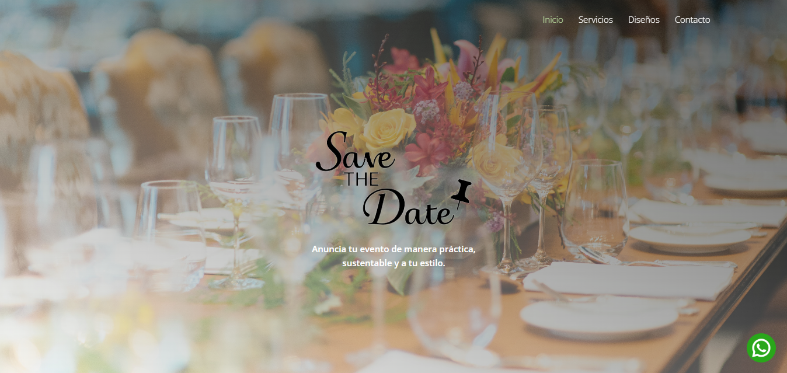
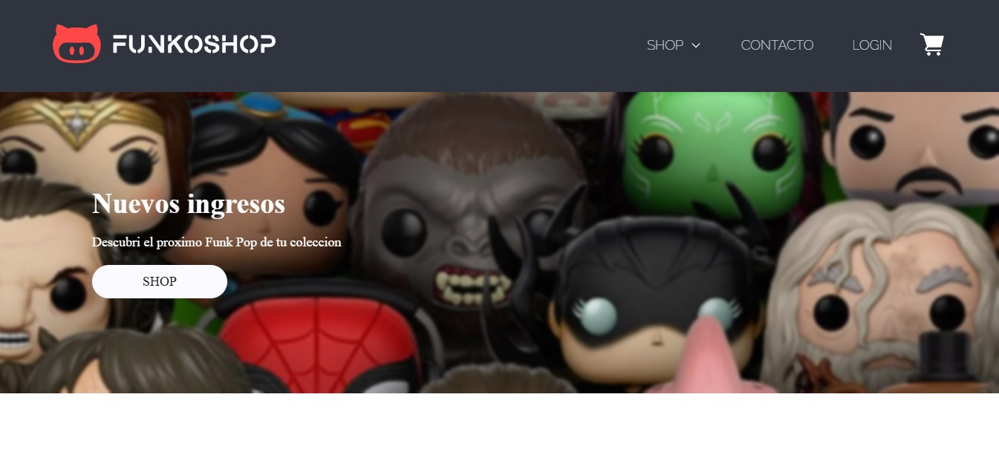

<h1 align="center">✨ María Camaña ✨</h1>
<h3 align="center">Front-End Designer & Developer 🌐</h3>

<p align="center">
  
  
  
  
</p>

---

## 🚀 Sobre el proyecto

Este es mi portfolio personal, creado para compartir mi perfil profesional, mostrar mis habilidades y algunos de los proyectos web en los que trabajé.

## ✨ Funcionalidades

- Diseño responsivo
- Experiencia de usuario cuidada
- Información sobre mi formación y experiencia
- Galería de proyectos realizados
- Enlaces directos a mis redes y contacto

## 🌐 Sitio publicado

👉 [https://invitacionesdigitaless.com/](https://invitacionesdigitaless.com/)

## 📂 Estructura del proyecto

```
📁 assets/
├── css/         → Estilos del sitio
├── imgs/        → Imágenes utilizadas
├── js/          → Scripts
├── vendors/    → Librerías externas (Bootstrap, Themify)
📄 index.html    → Página principal
📄 components.html → Componentes UI
```

## 💻 Tecnologías utilizadas

- HTML5
- CSS3
- JavaScript
- Bootstrap 4
- Git & GitHub

## 📸 Capturas

| Inicio | Portfolio |
|:----:|:----:|
|  |  |

## 👩‍💻 Sobre mí

Soy desarrolladora en formación con dos años de experiencia aprendiendo **JavaScript**. Me apasiona la tecnología y la resolución de problemas a través del código. Disfruto trabajar en proyectos que combinan creatividad y funcionalidad, siempre buscando mejorar mis habilidades.

## 📬 Contacto

- 📧 mariacamana998@gmail.com
- 📱 +54 9 2920 308378
- 🌐 [LinkedIn](https://www.linkedin.com/in/mar%C3%ADa-cama%C3%B1a-varela-831691267/)
- 🐱 [GitHub](https://github.com/M4rrix)
